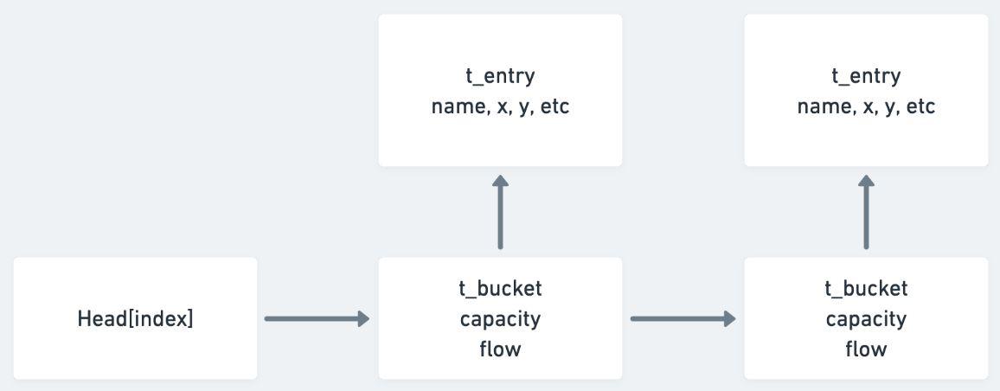
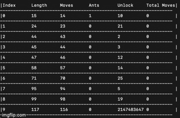

# Lem-In
This program tests the students ability to write a program that accepts a graph and moves ants through paths in the shortest amount of moves as possible.

## Core Data Structure
In this project, I used a hash table with embedded capacities and flows in order to accomodate
the Edmonds Karp algorithm. Each index position of the hash table has a linked list made of a t_bucket structure. It serves as the head element for the t_entry which contains information about the node such as name, x and y coordinate etc.

More importantly, it also facilitates the capacities and flows used by Edmonds Karp. If the algorithm was at node name 4 with links 1 and 2, the t_bucket struct at 4->1 would be the flow from 4->1. And then at node 1, the residual flow would be 1->4.

Use flag -t in order to see the hash table for a given map.

```
'-->' denotes a collision and shows the next bucket/entry in the list.

HT[2450]: {Name: 1 | Links: 2,5,start}
HT[2550]: {Name: 2 | Links: end,1,4}
HT[2652]: {Name: 3 | Links: start,4}
HT[2756]: {Name: 4 | Links: 2,3}
HT[2862]: {Name: 5 | Links: 6,1}
HT[2970]: {Name: 6 | Links: end,5}
HT[10440]: {Name: end | Comment: end | Links: 2,6}
HT[14361]: {Name: start | Comment: start | Links: 3,1}
```



## Edmonds Karp and BFS

For lem-in, I had to use a modified varation of the EK algorithm. Lem-in requires an undirected and essentially unweighted graph. All edges have the same capacity of 1. Flows and path discovery are both done via Breadth First Search.

### Rules for node discovery during flow augmentation phase

For a node to be reachable, ```capacity - flow > 0``` must be satisfied. During augmentation, capacity isn't altered. Flow is simply incremented on the forward path and degremented on the residual path.

### Rules for node discovery during pathfinding phase

After each iteration of EK augmenting a path, the pathfinding algo (also BFS) searches for new paths based on the updated augmented flows. For a node to be reachable, ```capacity - flow == 0``` must be satisfied.

## Ant Distro

During the pathfinding phase, path sets are added in ascending order. Naturally BFS handles that automatically. In the ant distribution phase, we must get ants along the path sets in the most efficient manner possible.

The amount of ants to use in each path depends on ```nbr_ants + (path length - 2) = moves```. If the path length (node count) was 4, it would take 1 ant 3 moves to get from start to finish. If the second path had a length of 8, it would take ```1 + (8 - 2) = 7``` moves. Using that information, we can also derive how many ants we can push through path 1 to equal 1 ant through path 2.

The equation would be ```moves - (path length - 2) = nbr_ants```. So you can push ```7-(4-2) = 5 ```ants through path 1 before the number of moves equals 1 ant moving through path 2 (7);

If this sounds confusing, check out the visual below. This is how the algorithm distributes the ants. The *unlock* field is the amount of ants needed in that particular path to *unlock* access to the next path. When it reaches that, ants trickle there too and repeats until the required ants are used up.

Use flag -d to see this for a respective map in this program.

